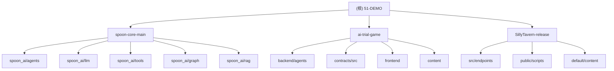

# 51-DEMO 项目文档


---

## 项目角色定义

> **重要：AI 助手必须理解以下项目角色**

| 项目 | 角色 | 可编辑 | 说明 |
|------|------|--------|------|
| **ai-trial-game** | 🎯 主开发目标 | ✅ 是 | 所有开发工作的焦点 |
| **spoon-core-main** | 📦 依赖库 | ⚠️ 仅参考 | ai-trial-game 的 Agent 框架依赖，仅在调试 Agent 问题时查看 |
| **SillyTavern-release** | 📚 参考代码 | ❌ 否 | 纯参考用途，遇到无法解决的问题时可借鉴 |

### 依赖关系

```
ai-trial-game
  └── spoon-core-main (本地 -e 安装)
        └── spoon_ai.agents.toolcall.ToolCallAgent
        └── spoon_ai.chat.ChatBot
        └── spoon_ai.tools.ToolManager
```

**注意**：`ai-trial-game/backend/requirements.txt` 中包含 `-e ../../spoon-core-main/spoon-core-main`，因此 spoon-core-main 必须保留。

---

## 项目愿景

**ai-trial-game** 是主要开发目标 - 一个区块链陪审团说服游戏，结合 AI 角色扮演与链上投票。

辅助项目：
- **spoon-core-main** - Python AI Agent 框架（作为依赖库）
- **SillyTavern-release** - Node.js 角色扮演聊天应用（仅供参考）

---

## 架构总览

```
D:\51-DEMO\
├── ai-trial-game/            # 🎯 主开发目标 - 区块链陪审团游戏
├── spoon-core-main/          # 📦 依赖库 - AI Agent SDK (只读参考)
├── SillyTavern-release/      # 📚 参考代码 - 角色扮演聊天应用 (只读)
└── .gitignore                # 全局忽略规则
```

### 技术栈分布

| 子项目 | 角色 | 主要语言 | 框架/工具 |
|--------|------|----------|-----------|
| ai-trial-game | 🎯 主开发 | Python + Solidity | FastAPI, Foundry, spoon-ai |
| spoon-core-main | 📦 依赖库 | Python 3.12+ | FastAPI, Pydantic |
| SillyTavern-release | 📚 参考 | JavaScript | Express, WebSocket |

---

## 模块结构图 (Mermaid)



---

## 模块索引

| 模块路径 | 角色 | 语言 | 职责 | 入口文件 |
|----------|------|------|------|----------|
| `ai-trial-game` | 🎯 主开发 | Python + Solidity | 区块链陪审团说服游戏 | `backend/main.py` |
| `spoon-core-main/spoon-core-main` | 📦 依赖库 | Python | AI Agent SDK（只读） | `main.py` |
| `SillyTavern-release/SillyTavern-release` | 📚 参考 | JavaScript | 角色扮演聊天（只读） | `server.js` |

---

## 运行与开发

### ai-trial-game（主项目）

```bash
cd ai-trial-game

# 后端
cd backend
python -m venv venv
venv\Scripts\activate  # Linux/Mac: source venv/bin/activate
pip install -r requirements.txt  # 会自动安装 spoon-core
uvicorn main:app --reload

# 智能合约
cd contracts
forge build
forge test
```

### spoon-core-main（仅供参考，通常不需要单独运行）

```bash
cd spoon-core-main/spoon-core-main
pip install -e .  # 开发模式安装
```

### SillyTavern-release（仅供参考）

```bash
cd SillyTavern-release/SillyTavern-release
npm install
npm start
```

---

## 测试策略

| 模块 | 测试框架 | 测试类型 | 运行命令 |
|------|----------|----------|----------|
| spoon-core-main | pytest | 单元测试、集成测试 | `pytest tests/` |
| ai-trial-game | pytest | Agent 集成测试 | `pytest backend/tests/` |
| ai-trial-game/contracts | Foundry | 智能合约测试 | `forge test` |
| SillyTavern-release | ESLint | 代码检查 | `npm run lint` |

---

## 编码规范

### Python (spoon-core-main, ai-trial-game)

- 使用 Python 3.12+
- 类型注解必须
- 异步优先 (async/await)
- Pydantic 用于数据验证

### JavaScript (SillyTavern-release)

- Node.js 18+
- ES Modules (type: "module")
- Express 框架
- ESLint 代码检查

### Solidity (ai-trial-game/contracts)

- Solidity 0.8.19
- Foundry 工具链
- NatSpec 注释

---

## AI 使用指引

### ⚠️ 重要规则

1. **主要工作在 ai-trial-game** - 所有开发、修改、新功能都在这里
2. **spoon-core-main 只读** - 仅在调试 Agent 相关问题时查看源码，不要修改
3. **SillyTavern-release 只读** - 仅在遇到无法解决的 UI/对话管理问题时参考借鉴

### 何时查看 spoon-core-main

- 调试 `SpoonJurorAgent` 继承的 `ToolCallAgent` 行为
- 理解 `ChatBot`、`Memory`、`ToolManager` 的工作原理
- 排查 Agent 生命周期问题

### 何时查看 SillyTavern-release

- 参考成熟的多 LLM 后端切换实现
- 借鉴对话历史管理方案
- 学习角色卡系统设计

### 修改代码时

1. 确认修改范围在 **ai-trial-game** 内
2. 遵循该项目的编码规范
3. 运行相关测试验证修改

### 关键文件

| 子项目 | 关键文件 | 说明 |
|--------|----------|------|
| ai-trial-game | `backend/agents/spoon_juror_agent.py` | 🎯 主要 Agent 实现（基于 spoon-core） |
| ai-trial-game | `backend/agents/juror_agent.py` | 备用独立 Agent 实现 |
| ai-trial-game | `backend/main.py` | FastAPI 后端入口 |
| ai-trial-game | `contracts/src/JuryVoting.sol` | 投票智能合约 |
| ai-trial-game | `frontend/index.html` | 游戏前端 |
| spoon-core-main | `spoon_ai/agents/toolcall.py` | 📦 ToolCallAgent 基类（只读参考） |
| spoon-core-main | `spoon_ai/chat.py` | 📦 ChatBot 实现（只读参考） |

---

## 环境变量

### ai-trial-game（主项目）

```bash
# LLM 配置
OPENAI_COMPATIBLE_API_KEY=xxx
OPENAI_COMPATIBLE_BASE_URL=xxx
OPENAI_COMPATIBLE_MODEL=claude-sonnet-4-5-20250929

# 或使用标准 OpenAI
OPENAI_API_KEY=sk-xxx
```

### spoon-core-main（依赖库，通常继承 ai-trial-game 的配置）

```bash
LLM_PROVIDER=openai
DEEPSEEK_API_KEY=xxx
GEMINI_API_KEY=xxx
PRIVATE_KEY=xxx  # Web3 钱包
RPC_URL=https://xxx
```

---

## 相关链接

- [SpoonOS GitHub](https://github.com/XSpoonAi/spoon-core)
- [SillyTavern GitHub](https://github.com/SillyTavern/SillyTavern)
