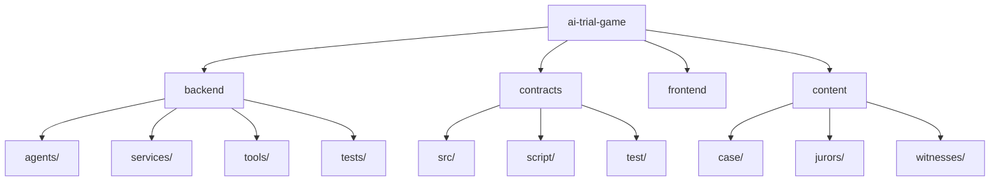

# AI Trial Game - 区块链陪审团说服游戏

> 结合 AI 角色扮演与链上投票的创新游戏

## 变更记录 (Changelog)

| 时间 | 操作 | 说明 |
|------|------|------|
| 2026-01-28 12:33:00 | 更新 | 添加 E2E 测试 (Playwright)，整理测试目录结构 |
| 2026-01-28 11:54:54 | 更新 | 全量扫描，补充架构图和模块详情 |
| 2026-01-27 18:30:00 | 更新 | Sepolia 迁移完成，添加 AI 协作规则 |
| 2026-01-27 17:58:49 | 创建 | 初始化模块文档 |

---

## 项目愿景

这是一个探索 AI 责任归属问题的互动叙事游戏。玩家扮演辩护律师，通过调查证据、询问当事人、说服陪审员，最终由 AI 驱动的陪审员在区块链上投票决定 AI 被告的命运。

**核心命题**：当 AI 机器人被恶意 prompt injection 攻击后造成伤害，责任应归谁承担？

---

## 架构总览

```
ai-trial-game/
+-- backend/          # Python FastAPI 后端服务
+-- contracts/        # Solidity 智能合约 (Foundry)
+-- frontend/         # 纯静态 HTML/CSS/JS 前端
+-- content/          # 游戏内容 (JSON 配置文件)
+-- tests/            # 跨模块测试
|   +-- e2e/          # Playwright E2E 测试
|   +-- utilities/    # 工具测试脚本
+-- game_cli.py       # CLI 测试脚本
```

**技术栈**:
- **后端**: Python 3.10+, FastAPI, OpenAI-compatible LLM API, SpoonOS Agent 框架
- **智能合约**: Solidity 0.8.19, Foundry (forge/anvil)
- **前端**: 原生 HTML5/CSS3/JavaScript (无框架)
- **区块链**: 本地 Anvil 或 Sepolia 测试网

---

## 模块结构图



## 模块索引

| 模块 | 路径 | 语言 | 职责 |
|------|------|------|------|
| backend | `backend/` | Python | REST API、LLM Agent 管理、链上投票工具 |
| contracts | `contracts/` | Solidity | 陪审员投票智能合约 (5 人白名单) |
| frontend | `frontend/` | JavaScript | 游戏界面、三阶段交互 |
| content | `content/` | JSON | 案件卷宗、证据、陪审员配置、证人对话树 |

---

## 入口与启动

### 后端服务

```bash
cd backend
pip install -r requirements.txt
python main.py
# 访问 http://localhost:5000/game
```

### 智能合约

```bash
cd contracts

# 本地开发 (Anvil)
anvil
forge script script/Deploy.s.sol --rpc-url http://127.0.0.1:8545 --broadcast

# Sepolia 部署
forge script script/Deploy.s.sol \
  --rpc-url https://sepolia.infura.io/v3/YOUR_KEY \
  --private-key $PRIVATE_KEY \
  --broadcast
```

---

## 对外接口

### REST API

| 端点 | 方法 | 说明 |
|------|------|------|
| `/state` | GET | 获取游戏状态 |
| `/jurors` | GET | 获取陪审员列表（5 人） |
| `/juror/{id}` | GET | 获取单个陪审员信息 |
| `/phase/{phase}` | POST | 切换游戏阶段 (investigation/persuasion/verdict) |
| `/chat/{juror_id}` | POST | 与陪审员对话 |
| `/vote` | POST | 触发链上投票 |
| `/reset` | POST | 重置游戏 |
| `/content/dossier` | GET | 获取案件卷宗 |
| `/content/evidence` | GET | 获取证据列表 |
| `/content/witnesses` | GET | 获取证人列表 |
| `/api/votes/verification` | GET | 获取投票验证信息 |

### 智能合约接口

```solidity
// JuryVoting.sol - 5 人白名单投票
constructor(address[5] memory _jurors);
function vote(bool guilty) external onlyJuror;
function getVoteState() external view returns (uint guiltyVotes, uint notGuiltyVotes, uint totalVoted, bool closed);
function getVerdict() external view returns (string memory);
```

---

## 关键依赖与配置

### Python 依赖

| 依赖 | 用途 |
|------|------|
| `fastapi` | Web 后端框架 |
| `uvicorn` | ASGI 服务器 |
| `openai` | LLM API 调用 |
| `web3` | 区块链交互 |
| `spoon-ai` | Agent 框架 (SpoonOS) |
| `pydantic` | 数据验证 |

### 环境变量 (backend/.env)

```bash
# LLM 配置
OPENAI_COMPATIBLE_API_KEY=xxx
OPENAI_COMPATIBLE_BASE_URL=https://api.example.com/v1
OPENAI_COMPATIBLE_MODEL=claude-sonnet-4-5-20250929

# 区块链
RPC_URL=http://127.0.0.1:8545  # 或 Sepolia RPC
JURY_VOTING_CONTRACT_ADDRESS=0x5FbDB2315678afecb367f032d93F642f64180aa3
JURY_VOTING_PRIVATE_KEYS=0x...,0x...,0x...,0x...,0x...

# 部署用陪审员地址
JUROR_1=0x...
JUROR_2=0x...
JUROR_3=0x...
JUROR_4=0x...
JUROR_5=0x...
```

---

## 数据模型

### 陪审员配置 (content/jurors/*.json)

当前 5 位陪审员：
- `juror_chen` - Chen (AI 软件工程师，技术派)
- `juror_liu` - Liu 女士
- `juror_wang` - 王建国
- `juror_zhang` - 张敏 (产品安全经理)
- `juror_li` - 李辩 (公设辩护人)

```json
{
  "id": "juror_chen",
  "name": "Chen",
  "initial_stance": 15,
  "topic_weights": {
    "technical_details": 20,
    "external_attack": 15,
    "victim_position": -5
  },
  "first_message": "I can follow technical arguments..."
}
```

### 立场值系统

- 范围：-100 (有罪) 到 +100 (无罪)
- 投票阈值：stance > 0 投无罪，否则投有罪
- 51% 规则：3/5 票决定最终判决

### 游戏阶段

1. **investigation** - 调查阶段：查看卷宗、证据、询问证人
2. **persuasion** - 说服阶段：与 5 位陪审员对话
3. **verdict** - 审判阶段：链上投票、显示结果

---

## 目录结构

```
ai-trial-game/
+-- backend/
|   +-- agents/
|   |   +-- juror_agent.py         # 独立 JurorAgent 实现
|   |   +-- spoon_juror_agent.py   # SpoonOS Agent 实现 (主要)
|   +-- services/
|   |   +-- agent_manager.py       # Agent 管理器
|   +-- tools/
|   |   +-- voting_tool.py         # 链上投票工具 (EIP-1559)
|   |   +-- spoon_voting_tool.py   # SpoonOS 投票工具
|   +-- tests/                     # pytest 测试
|   +-- main.py                    # FastAPI 入口
|   +-- pytest.ini
+-- contracts/
|   +-- src/
|   |   +-- JuryVoting.sol         # 5 人白名单投票合约
|   +-- script/
|   |   +-- Deploy.s.sol           # 部署脚本
|   +-- test/
|   |   +-- JuryVoting.t.sol       # Forge 测试
|   +-- foundry.toml
+-- content/
|   +-- case/
|   |   +-- dossier.json           # 案件卷宗
|   |   +-- evidence/              # 证据文件
|   +-- jurors/                    # 5 个陪审员配置
|   +-- witnesses/                 # 证人对话树
+-- frontend/
|   +-- index.html
|   +-- block-explorer.html        # 区块浏览器
|   +-- css/
|   +-- js/
|       +-- game.js                # 游戏主逻辑
|       +-- api.js                 # API 调用
|       +-- dialogue.js            # 对话系统
+-- game_cli.py                    # CLI 测试脚本
```

---

## 测试与质量

### Python 测试

```bash
cd backend
pytest tests/ -v
```

测试文件:
- `test_juror_agent.py` - JurorAgent 单元测试
- `test_spoon_juror_agent.py` - SpoonOS Agent 测试
- `test_voting_tool.py` - 投票工具测试
- `test_api.py` - API 端点测试

### 智能合约测试

```bash
cd contracts
forge test -vvv
```

### 前端 E2E 测试 (Playwright)

```bash
# 安装依赖
npm install -D @playwright/test
npx playwright install chromium

# 运行测试 (需后端运行)
npx playwright test --config=tests/e2e/playwright.config.js
```

测试文件:
- `tests/e2e/game-flow.spec.js` - 完整游戏流程
- `tests/e2e/investigation.spec.js` - 调查阶段
- `tests/e2e/persuasion.spec.js` - 说服阶段
- `tests/e2e/verdict.spec.js` - 审判阶段

### 工具测试

```bash
# 根目录下的工具测试脚本 (已移至 tests/utilities/)
python tests/utilities/test_api_fix.py
python tests/utilities/test_port_check.py
python tests/utilities/test_windows_fix.py
```

---

## AI 使用指引

### 上下文优先级

1. **优先阅读**:
   - `backend/main.py` - API 入口
   - `backend/agents/spoon_juror_agent.py` - 核心 Agent 逻辑
   - `contracts/src/JuryVoting.sol` - 投票合约

2. **内容配置**:
   - `content/jurors/*.json` - 陪审员角色卡
   - `content/case/dossier.json` - 案件卷宗

### 关键概念

- **Stance Value**: 陪审员隐藏立场值 (-100 到 100)，正值倾向无罪
- **Topic Weights**: 每个陪审员对不同话题的敏感度权重
- **ANALYSIS Tag**: LLM 回复中的隐藏标记，用于解析话题和影响

### 修改建议

- 添加新陪审员: 在 `content/jurors/` 创建 JSON 文件
- 修改 API: 编辑 `backend/main.py`
- 修改合约: 编辑 `contracts/src/JuryVoting.sol`，然后重新部署

---

## 相关文件清单

| 文件 | 说明 |
|------|------|
| `backend/main.py` | FastAPI 后端入口 (570 行) |
| `backend/agents/spoon_juror_agent.py` | SpoonOS Agent 实现 (385 行) |
| `backend/agents/juror_agent.py` | 独立 Agent 实现 (386 行) |
| `backend/services/agent_manager.py` | Agent 管理器 (155 行) |
| `backend/tools/voting_tool.py` | 链上投票工具 (234 行) |
| `contracts/src/JuryVoting.sol` | 投票合约 (113 行) |
| `frontend/js/game.js` | 游戏主逻辑 (904 行) |
| `content/case/dossier.json` | 案件卷宗 |
| `content/jurors/*.json` | 5 个陪审员配置 |

## Changelog

### v0.2.0 - ReAct Agent Upgrade (2026-01-29)

Upgraded `SpoonJurorAgent` from dialog-only to full ReAct (Reason-Act) pattern with tool calling.

**New Features:**
- **Evidence Lookup Tool** (`lookup_evidence`) - Agents can autonomously retrieve case evidence
- **On-chain Voting Tool** (`cast_vote`) - Agents can cast blockchain votes during dialogue
- **Tool Action Visualization** - Frontend displays agent tool usage narratively

**Backend Changes:**
- `backend/tools/evidence_tool.py` - New `EvidenceLookupTool`
- `backend/agents/spoon_juror_agent.py` - ReAct loop with `tool_choices=AUTO`, `max_steps=3`
- `backend/services/agent_manager.py` - Voting config injection with `juror_index`
- `backend/main.py` - New `ToolAction` model, `tool_actions`/`has_voted` in API response

**Frontend Changes:**
- `frontend/js/game.js` - Tool action rendering with XSS protection

**Tests:**
- `backend/tests/test_evidence_tool.py` - Evidence tool unit tests
- `backend/tests/test_react_agent.py` - ReAct loop and AgentManager tests

**Reports:**
- `REPORT_REACT_BACKEND.md` - Backend implementation details
- `REPORT_REACT_VISUALIZATION.md` - Frontend visualization details